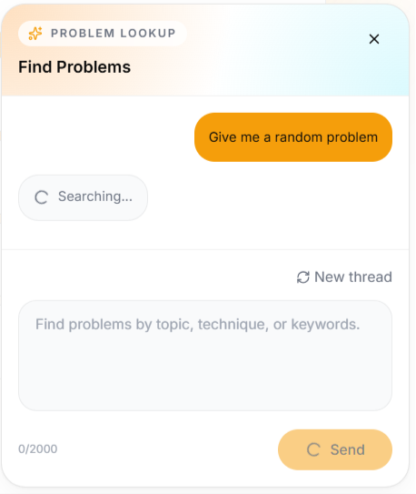

# Evidence Pack — Group 6 Project - HexaCode

---

## 1. Cover

| Field | Details |
|---|---|
| **Group Number** | Group 6 |
| **Member Names** | Minh Tuấn · Thành Vinh · Anh Hoàng · Hoàng Nhân · Mạnh Khang · Ngọc Thắng · Hoàng Thông · Thành Tâm |
| **Database Engine** | Amazon RDS PostgreSQL |
| **Paradigm** | Relational |
| **Database Path** | RDS Postgres / relational |

---

## 2. Data Access Pattern Log

### Part A — Access Pattern Inventory *(từ Must-Have 1)*

| # | Entity / Feature | Operation | Frequency | Notes |
|---|---|---|---|---|
| 1 | `[e.g. User]` | `[e.g. Lookup by email]` | `[e.g. High]` | |
| 2 | | | | |
| 3 | | | | |
| 4 | | | | |
| 5 | | | | |

> Thêm hàng tuỳ số access pattern đã identify ở W2.

---

### Part B — Engine & Paradigm Selection Reasoning

**Engine chosen:** `[Engine name + version]`  
**Paradigm:** `[Relational / Key-Value / Document / Graph]`

**Reasoning:**

> _Giải thích tại sao paradigm này phù hợp với access patterns ở Part A. Ví dụ: "Dữ liệu problem, submission và user có quan hệ nhiều-nhiều → cần JOIN → chọn relational. DynamoDB bị loại vì query pattern phức tạp, không chỉ partition key lookup."_

**Trade-offs acknowledged:**

| What we gain | What we give up |
|---|---|
| `[e.g. Strong consistency, ACID transactions]` | `[e.g. Horizontal scale complexity]` |
| | |

**If high-cost managed service:** *(Bỏ qua nếu không áp dụng)*
- Estimated monthly cost: `$[X]/month` based on `[instance type, storage, I/O]`
- Cost justification: `[Reasoning]`

---

### Part C — Final Decision Log

**Decision date:** `[DD/MM/YYYY]`  
**Decision maker(s):** `[Names]`  
**Alternatives considered:**

| Alternative | Reason rejected |
|---|---|
| `[e.g. DynamoDB]` | `[e.g. Complex join patterns not suited for key-value]` |
| `[e.g. Self-hosted MongoDB on EC2]` | `[e.g. Operational overhead too high for team size]` |

---

## 3. Deployment Evidence

### 3.1 Database Instance Created & Running

<br>*Note: - Chọn db.m7i.large (2 vCPU, 8GB RAM) thay vì dòng T (burstable) vì m7i cung cấp CPU performance ổn định, không bị throttle khi hết CPU credits — phù hợp với workload liên tục từ 3 Fargate services (problem, submission, identity) kết nối đồng thời. - Nhóm em chọn PostgreSQL thay vì MySQL hay DynamoDB vì PostgreSQL mạnh hơn về xử lý các kiểu dữ liệu phức tạp (JSONB) và có tính năng pgvector cực tốt để lưu trữ dữ liệu vector cho AI sau này và hệ thống bài tập cần tính nhất quán cao (ACID) và các câu lệnh JOIN phức tạp giữa User - Problem - Submission. NoSQL sẽ rất khó khăn và tốn kém khi thực hiện các truy vấn quan hệ như vậy.*

---

### 3.2 Encryption at Rest

<br>*Note: Encryption enabled với AWS-managed KMS key aws/rds — chọn AWS-managed thay vì customer CMK vì chưa có compliance mandate và muốn key rotation tự động, không làm giảm hiệu năng của hệ thống.*

---

### 3.3 Multi-AZ / High Availability

<br>*Note: Single-AZ rẻ hơn nhưng rủi ro cao. Chọn Multi-AZ để đảm bảo Tính sẵn sàng cao (High Availability). Nếu một trung tâm dữ liệu của AWS gặp sự cố (thiên tai, mất điện), RDS sẽ tự động chuyển hướng (failover) sang Zone dự phòng trong < 60 giây, giúp hệ thống không bị gián đoạn.*

---

### 3.4 Automated Backups

<br>*Note: Cấu hình sao lưu tự động hàng ngày với thời gian lưu trữ 7 ngày. Sao lưu tự động loại bỏ sai sót của con người. Nó cho phép Point-in-Time Recovery, nghĩa là bạn có thể khôi phục dữ liệu chính xác đến từng giây trong quá khứ nếu lỡ tay chạy lệnh DELETE nhầm.*

---

### 3.5 Security Group — DB Tier Inbound Rules

**Screenshot / CLI output:**

```
[aws ec2 describe-security-groups --group-ids <db-sg-id>]
```

**Notes:**  
`[e.g. "Inbound chỉ cho phép SG của app-tier (ECS tasks) — không expose port 5432 ra internet hay bastion. Source là SG ID, không phải CIDR, để rule không bị stale khi IP thay đổi."]`

---

### 3.6 Parameter / Configuration Tuning *(nếu áp dụng)*

**Screenshot / CLI output:**

```
[Custom parameter group settings]
```

**Notes:**  
`[e.g. "Tăng max_connections lên 200 vì mỗi Fargate task mở tối đa 5 connection. Default 100 sẽ bị saturate ở ~20 tasks."]`

---

## 4. Working Query Evidence

- JOIN Query
  
  <br>*Note: Truy vấn kết hợp thông tin từ 3 bảng khác nhau trong một câu lệnh duy nhất (Relation Model). Chỉ với 1 request, ứng dụng có thể lấy toàn bộ thông tin cần thiết, giảm thiểu số lượng kết nối tới DB, tối ưu hóa tốc độ tải trang.*

- Indexed lookup 

  <br>*Note: Hệ thống sử dụng Index Scan thay vì Sequential Scan khi tìm kiếm User. Nếu không có Index, DB phải quét từng dòng một (Sequential Scan). Với Index, tốc độ tìm kiếm là cực nhanh (O(log n)). Hệ thống được thiết kế để đảm bảo tính scalability, vẫn chạy mượt khi có hàng triệu người dùng.*
  
---

### 4.1 Operation 1 — *[Tên operation theo paradigm]*

**Paradigm requirement:**  
- Relational → JOIN qua ≥2 related tables  
- Key-Value → Query theo partition key  
- Document → Aggregation pipeline  
- Graph → N-hop traversal  

**Query / Command:**

```sql
-- [Paste query here]
-- e.g. SELECT u.username, COUNT(s.id) AS submission_count
--      FROM users u
--      JOIN submissions s ON s.user_id = u.id
--      WHERE u.created_at > '2025-01-01'
--      GROUP BY u.id;
```

**Result screenshot:**

> *(Embed ảnh hoặc paste output có real data)*

```
[Paste result rows / document / traversal output here]
```

**What this demonstrates:**  
`[e.g. "JOIN giữa bảng users và submissions, confirm foreign key relationship hoạt động đúng và index trên user_id được sử dụng (EXPLAIN ANALYZE output đính kèm)."]`

---

### 4.2 Operation 2 — *[Tên operation theo paradigm]*

**Paradigm requirement:**  
- Relational → Indexed lookup (EXPLAIN shows Index Scan)  
- Key-Value → GSI query (không Scan)  
- Document → Indexed-field lookup  
- Graph → Property / node lookup  

**Query / Command:**

```sql
-- [Paste query here]
```

**Result screenshot:**

> *(Embed ảnh hoặc paste output có real data)*

```
[Paste result here]
```

**What this demonstrates:**  
`[e.g. "Index lookup trên email field, EXPLAIN ANALYZE confirm Index Scan thay vì Seq Scan — query cost O(log n)."]`

---

## 5. Lambda + Bedrock Evidence

<br>*Note: The user asks the AI questions in the frontend chat widget.*

<br>*Note: A lambda is triggered when a request is received.*

<br>*Note: Successful response from aws bedrock -> lambda in frontend.*


---

### 5.1 Lambda Trigger — CloudWatch Logs

**Log stream:** `[/aws/lambda/<function-name>]`  
**Timestamp:** `[YYYY-MM-DD HH:MM:SS UTC]`

**CloudWatch log entry:**

```
[Paste relevant log lines here — include REQUEST ID, timestamp, and key output]
e.g.
START RequestId: abc-123 Version: $LATEST
INFO Triggering Bedrock RAG for query: "..."
END RequestId: abc-123
REPORT RequestId: abc-123 Duration: 1243.12 ms Billed: 1300 ms
```

**Notes:**  
`[e.g. "Lambda được trigger từ SQS message sau khi submission-service push event. Cold start ~800ms, warm ~120ms."]`

---

### 5.2 Bedrock Retrieve / RetrieveAndGenerate Response

**Method used:** `[ ]` RetrieveAndGenerate &nbsp;&nbsp; `[ ]` Retrieve (then generate separately)  
**Knowledge Base ID:** `[kb-XXXXXXXXXX]`  
**Model used:** `[e.g. anthropic.claude-3-sonnet-20240229-v1:0]`

**Response (from Lambda log or CLI):**

```json
{
  "output": {
    "text": "[AI response text here]"
  },
  "citations": [
    {
      "retrievedReferences": [
        {
          "content": { "text": "[Source chunk]" },
          "location": { "s3Location": { "uri": "s3://..." } }
        }
      ]
    }
  ]
}
```

**Notes:**  
`[e.g. "Vector search hit S3 vector bucket, retrieved top-3 relevant chunks, passed vào Claude claude-3-sonnet. Response latency ~2.1s end-to-end từ Lambda invocation."]`

---

## 6. VPC + Networking Evidence

---

### 6.1 S3 Gateway Endpoint — Route Table

**Screenshot / CLI output:**

```
[aws ec2 describe-route-tables --route-table-ids <rtb-id>]
```

> *(Hoặc console screenshot showing route: pl-XXXXXX → vpce-XXXXXX)*

**Notes:**  
`[e.g. "S3 Gateway Endpoint thêm vào route table của private subnet để traffic tới S3 không đi qua NAT Gateway — giảm NAT cost và latency. Áp dụng cho cả problem-assets và submission-artifacts buckets."]`

---

### 6.2 DB Security Group — Inbound Rules (App-tier SG as Source)

**Screenshot / CLI output:**

```
[aws ec2 describe-security-groups --group-ids <db-sg-id>
 — showing InboundRules with UserIdGroupPairs referencing app-tier SG]
```

**Notes:**  
`[e.g. "Source là SG ID của ECS task security group, không phải CIDR. Khi Fargate task scale out/in, IP thay đổi nhưng SG rule vẫn đúng — không cần cập nhật thủ công."]`

---

## 7. Negative Security Test

> **Mục tiêu:** Chứng minh unauthorized access bị **denied** — không phải chỉ claim rằng security đã được cấu hình.

---

### 7.1 Test Description

**What was attempted:**  
`[e.g. "Kết nối trực tiếp tới RDS endpoint từ EC2 instance không nằm trong app-tier security group (dùng bastion test instance với SG khác)."]`

**From:** `[e.g. EC2 instance i-XXXXXXXXXX, SG: sg-YYYYYYYY (not app-tier)]`  
**To:** `[e.g. RDS endpoint xxx.rds.amazonaws.com:5432]`  
**Expected result:** Connection refused / timeout  

---

### 7.2 Evidence of Denial

**Screenshot / CLI output:**

```
[e.g.
$ psql -h xxx.rds.amazonaws.com -U admin -d mydb
psql: error: connection to server at "xxx.rds.amazonaws.com" (10.0.3.45), 
port 5432 failed: Connection timed out
]
```

**Notes:**  
`[e.g. "Timeout sau 30s confirm rằng security group không cho phép inbound 5432 từ SG ngoài app-tier. VPC flow log (nếu có) cũng show REJECT action."]`

---

## 8. Bonus — Real-World Ops Scenario *(Tùy chọn)*

> Chỉ điền nếu nhóm thực hiện ít nhất 1 scenario từ Bonus section.

---

### 8.1 Scenario Name

**Scenario attempted:** `[e.g. Simulated AZ failure / Blue-green deployment / Point-in-time restore]`  
**Date & time:** `[YYYY-MM-DD HH:MM UTC]`

---

### 8.2 Pre-condition (Before)

**Screenshot / metric:**

> *(Embed ảnh hoặc paste metric/log trước khi thực hiện scenario)*

```
[Pre-state evidence]
```

---

### 8.3 Execution

**Steps performed:**

1. `[Step 1]`
2. `[Step 2]`
3. `[Step 3]`

**Timing:**

| Event | Timestamp | Elapsed |
|---|---|---|
| Scenario triggered | `HH:MM:SS` | 0s |
| Failure detected | `HH:MM:SS` | `Xs` |
| Failover complete | `HH:MM:SS` | `Xs` |
| Service restored | `HH:MM:SS` | `Xs` |

---

### 8.4 Post-condition (After)

**Screenshot / metric:**

> *(Embed ảnh hoặc paste metric/log sau khi scenario hoàn tất)*

```
[Post-state evidence]
```

---

### 8.5 Reflection

**What worked well:**  
`[e.g. "Multi-AZ failover hoàn tất trong 87s, trong ngưỡng RTO mong đợi < 2 phút."]`

**What surprised us / could be improved:**  
`[e.g. "ElastiCache không failover tự động trong thời gian RDS failover — cache cold start gây tăng latency thêm ~15s. Cần pre-warm cache sau failover."]`

---

*— End of Evidence Pack —*
