# Evidence Pack — Group 6 Project - HexaCode

---

## 1. Cover

| Field | Details |
|---|---|
| **Group Number** | Group 6 |
| **Member Names** | Minh Tuấn · Thành Vinh · Anh Hoàng · Hoàng Nhân · Mạnh Khang · Ngọc Thắng · Hoàng Thông · Thành Tâm |
| **Database Engine** | Amazon RDS PostgreSQL |
| **Paradigm** | Relational |
| **Database Path** | RDS Postgres / relational |

---

## 2. Data Access Pattern Log

### Part A — Access Pattern Inventory 

| # | Entity / Feature | Operation | Frequency | Notes |
|---|---|---|---|---|
| 1 | `User` | `Lookup by username/email (đăng nhập)` | `High` | `Cần tốc độ phản hồi cực nhanh` |
| 2 | `Problem` | `Get problem details by ID` | `Medium` | `Truy xuất đề bài và metadata` | 
| 3 |`Submission` | `JOIN Submission + User + Problem (xem lịch sử)` | `High` | `Truy vấn quan hệ phức tạp để hiện tên user và tên bài` |
| 4 | `AI Chatbot` | `Retrieve vector embeddings (Bedrock)` | `Low` | `Kết nối dữ liệu bài tập với AI` |

---

### Part B — Engine & Paradigm Selection Reasoning
Pattern 1(Auth):<br>
- **Engine chosen:** `RDS PostgreSQL `  
- **Paradigm:** `Relational`<br>
- **Reasoning:** `DPostgreSQL xử lý cực nhanh các point lookup. Điều này giúp DB tìm thấy user ngay lập tức mà không cần quét toàn bộ bảng (Full Table Scan).`

Pattern 2(Submission History):<br>
- **Engine chosen:** `RDS PostgreSQL `  
- **Paradigm:** `Relational`<br>
- **Reasoning:** `Hiệu quả nhất vì đây là truy vấn liên kết (JOIN) giữa 3 bảng: submissions, users và problems. Việc dùng Relational engine giúp thực hiện JOIN tại server-side, trả về kết quả cuối cùng chỉ trong 1 request duy nhất thay vì phải gọi DB nhiều lần.`

Pattern 3(Chatbot Metadata):<br>
- **Engine chosen:** `RDS PostgreSQL `  
- **Paradigm:** `Relational`<br>
- **Reasoning:** `Metadata bài tập yêu cầu sự nhất quán (Consistency). PostgreSQL đảm bảo dữ liệu cung cấp cho AI luôn là phiên bản mới nhất và chính xác nhất.`

**If high-cost managed service:** 
- Estimated monthly cost: `~$280 - $320/month` based on `[db.m7i.large, 200GB SSD, Multi-AZ]`
- Cost justification: `Dựa trên instance db.m7i.large tại Region Singapore, cấu hình Multi-AZ để đảm bảo HA, 200GB SSD gp3 và chi phí cho backup/snapshot hàng ngày. Đây là chi phí hợp lý để đổi lấy sự ổn định và bảo mật cho dữ liệu bài thi của người dùng.`

---

### Part C — "Wrong-paradigm" test

**Pattern Selected:** `Pattern 2`  
**Reasoning:** `Nếu sử dụng Key-Value store (như DynamoDB) cho pattern này, hệ thống sẽ gặp vấn đề lớn về hiệu năng và chi phí. Vì DynamoDB không hỗ trợ JOIN, ứng dụng sẽ phải thực hiện "Client-side JOIN": gọi bảng Submissions để lấy danh sách ID, sau đó gọi tiếp hàng chục request tới bảng Problems để lấy tiêu đề bài tập. Với tần suất 300 calls/phút, số lượng Read Capacity Units (RCU) sẽ tăng vọt, gây độ trễ (latency) lớn và chi phí vận hành cao hơn gấp nhiều lần so với một lệnh SQL JOIN đơn giản trên PostgreSQL.`  

---

## 3. Deployment Evidence

### 3.1 Database Instance Created & Running

**Screenshot:**

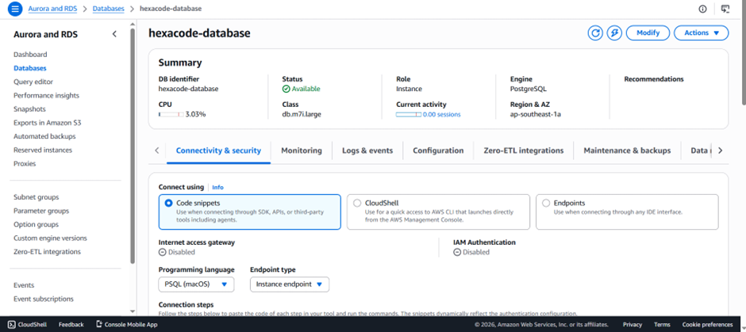

**Notes:**<br>
`- Chọn db.m7i.large (2 vCPU, 8GB RAM) thay vì dòng T (burstable) vì m7i cung cấp CPU performance ổn định, không bị throttle khi hết CPU credits — phù hợp với workload liên tục từ 3 Fargate services (problem, submission, identity) kết nối đồng thời.`<br>
`- Nhóm em chọn PostgreSQL thay vì MySQL hay DynamoDB vì PostgreSQL mạnh hơn về xử lý các kiểu dữ liệu phức tạp (JSONB) và có tính năng pgvector cực tốt để lưu trữ dữ liệu vector cho AI sau này và hệ thống bài tập cần tính nhất quán cao (ACID) và các câu lệnh JOIN phức tạp giữa User - Problem - Submission. NoSQL sẽ rất khó khăn và tốn kém khi thực hiện các truy vấn quan hệ như vậy.`

---

### 3.2 Encryption at Rest

**Screenshot:**

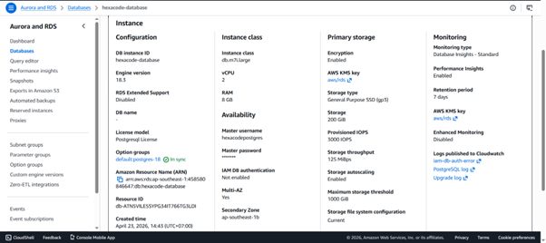

**Notes:** 
`Encryption enabled với AWS-managed KMS key aws/rds — chọn AWS-managed thay vì customer CMK vì chưa có compliance mandate và muốn key rotation tự động, không làm giảm hiệu năng của hệ thống.`

---

### 3.3 Multi-AZ / High Availability

**Screenshot:**


**Notes:** 
`Single-AZ rẻ hơn nhưng rủi ro cao. Chọn Multi-AZ để đảm bảo Tính sẵn sàng cao (High Availability). Nếu một trung tâm dữ liệu của AWS gặp sự cố (thiên tai, mất điện), RDS sẽ tự động chuyển hướng (failover) sang Zone dự phòng trong < 60 giây, giúp hệ thống không bị gián đoạn.`

---

### 3.4 Automated Backups

**Screenshot:**

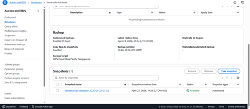

**Notes:** 
`Cấu hình sao lưu tự động hàng ngày với thời gian lưu trữ 7 ngày. Sao lưu tự động loại bỏ sai sót của con người. Nó cho phép Point-in-Time Recovery, nghĩa là bạn có thể khôi phục dữ liệu chính xác đến từng giây trong quá khứ nếu lỡ tay chạy lệnh DELETE nhầm.`

---

### 3.5 Parameter / Configuration Tuning *(nếu áp dụng)*

**Screenshot / CLI output:**

```
[Custom parameter group settings]
```

**Notes:**  
`[e.g. "Tăng max_connections lên 200 vì mỗi Fargate task mở tối đa 5 connection. Default 100 sẽ bị saturate ở ~20 tasks."]`

---

## 4. Working Query Evidence
  
---

### 4.1 Operation 1 — *[JOIN query]*

**Paradigm requirement:**  
- Relational → JOIN qua ≥2 related tables  
- Key-Value → Query theo partition key  
- Document → Aggregation pipeline  
- Graph → N-hop traversal  

**Query / Command:**

```sql
SELECT 
    u.username, 
    p.title AS problem_title, 
    s.verdict_code, 
    s.status_code, 
    s.created_at
FROM 
    submission.submissions s
JOIN 
    app_identity.users u ON s.user_id = u.id
JOIN 
    problem.problems p ON s.problem_id = p.id
ORDER BY 
    s.created_at DESC;
```

**Result screenshot:**

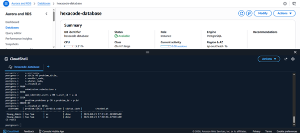

**What this demonstrates:**  
`Truy vấn kết hợp thông tin từ 3 bảng khác nhau trong một câu lệnh duy nhất (Relation Model). Chỉ với 1 request, ứng dụng có thể lấy toàn bộ thông tin cần thiết, giảm thiểu số lượng kết nối tới DB, tối ưu hóa tốc độ tải trang.`

---

### 4.2 Operation 2 — *[Indexed lookup]*

**Paradigm requirement:**  
- Relational → Indexed lookup (EXPLAIN shows Index Scan)  
- Key-Value → GSI query (không Scan)  
- Document → Indexed-field lookup  
- Graph → Property / node lookup  

**Query / Command:**

```sql
SELECT
    id,
    username,
    status_code
FROM
    app_identity.users
WHERE
    username = 'Hoang_Admin';
```

**Result screenshot:**

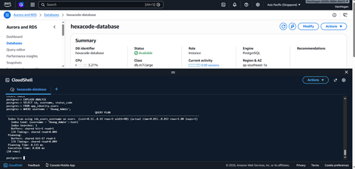

**What this demonstrates:**  
`Hệ thống sử dụng Index Scan thay vì Sequential Scan khi tìm kiếm User. Nếu không có Index, DB phải quét từng dòng một (Sequential Scan). Với Index, tốc độ tìm kiếm là cực nhanh (O(log n)). Hệ thống được thiết kế để đảm bảo tính scalability, vẫn chạy mượt khi có hàng triệu người dùng.`

---

## 5. Lambda + Bedrock Evidence

### 5.1 Lambda Trigger — CloudWatch Logs

**Screenshot:**

1. The user asks the AI questions in the frontend chat widget.<br>


2. A lambda is triggered when a request is received.<br>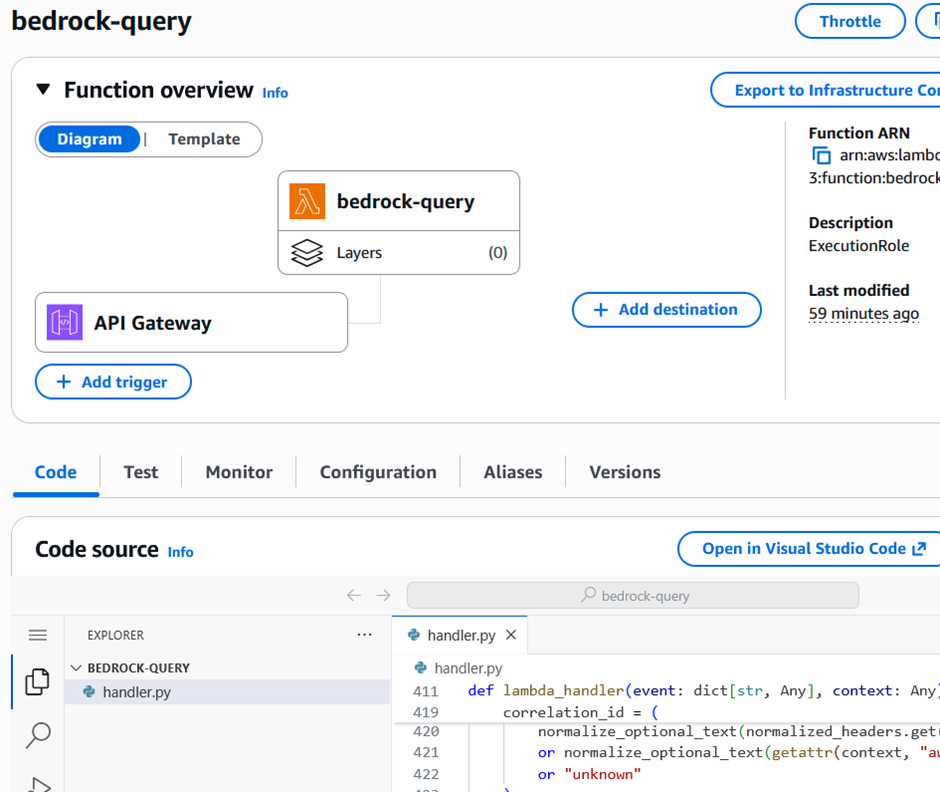


3. Successful response from aws bedrock -> lambda in frontend.<br>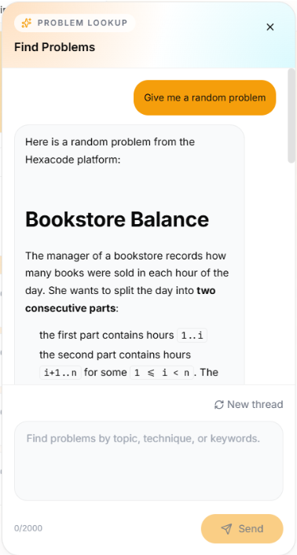

---

**CloudWatch log entry:**

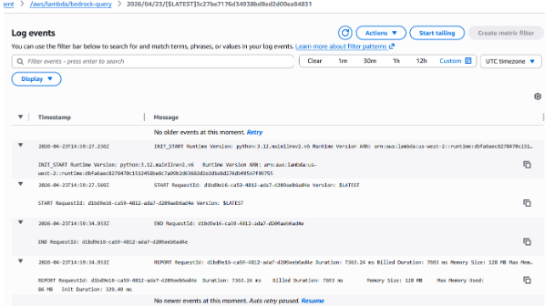

**Notes:**  
`Log thực tế xác nhận Lambda đã được kích hoạt thành công. Thời gian chạy (Duration) là 7363.24 ms. Lambda đã thực hiện kết nối với Bedrock, gửi yêu cầu và đợi AI xử lý để trả về kết quả. Việc log không có mã lỗi (Error) minh chứng cho sự ổn định của kết nối giữa
Lambda và Bedrock.`

---

### 5.2 Bedrock Retrieve / RetrieveAndGenerate Response

**Method used:** `[ ]` RetrieveAndGenerate &nbsp;&nbsp; `[ ]` Retrieve (then generate separately)  
**Knowledge Base ID:** `[kb-XXXXXXXXXX]`  
**Model used:** `[e.g. anthropic.claude-3-sonnet-20240229-v1:0]`

**Response (from Lambda log or CLI):**

```json
{
  "output": {
    "text": "[AI response text here]"
  },
  "citations": [
    {
      "retrievedReferences": [
        {
          "content": { "text": "[Source chunk]" },
          "location": { "s3Location": { "uri": "s3://..." } }
        }
      ]
    }
  ]
}
```

**Notes:**  
`[e.g. "Vector search hit S3 vector bucket, retrieved top-3 relevant chunks, passed vào Claude claude-3-sonnet. Response latency ~2.1s end-to-end từ Lambda invocation."]`

---

## 6. VPC + Networking Evidence

### 6.1 S3 Gateway Endpoint — Route Table

**Screenshot:**

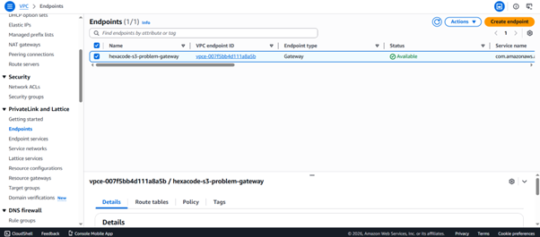

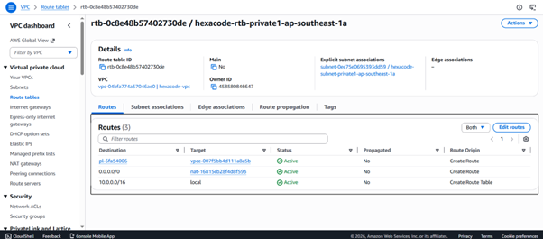

**Notes:**<br>
`- Thiết lập đường kết nối riêng từ VPC tới S3.`<br>
`- Chọn sử dụng Gateway Endpoint thay cho internet/NAT gateway vì dữ liệu file bài nộp đi thẳng từ Server tới S3 qua mạng nội bộ AWS, không bao giờ lộ ra Internet và truy cập qua Endpoint là miễn phí, trong khi đi qua NAT Gateway bạn phải trả tiền trên mỗi GB dữ liệu. Với hệ thống nhiều file bài tập, đây là cách tiết kiệm chi phí tối ưu nhất.`

---

### 6.2 DB Security Group — Inbound Rules (App-tier SG as Source)

**Screenshot:**

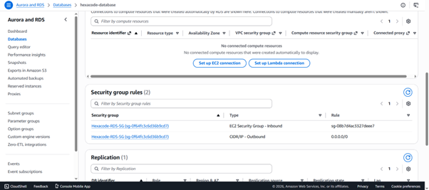

**Notes:**<br>
`Inbound Rule chỉ cho phép duy nhất Security Group của tầng ứng dụng (App-tier) truy cập vào cổng Database. Cách thiết lập này tuân thủ nguyên tắc "Least Privilege", cô lập hoàn toàn Database khỏi các truy cập trái phép từ bên ngoài môi trường VPC.`<br>
`Dùng SG ID vì dù server tầng App có thay đổi IP liên tục (do Auto Scaling), Database vẫn tự động nhận diện và cho phép truy cập mà không cần cấu hình lại thủ công.`

---

## 7. Negative Security Test
---

**What was attempted:**  
`Thử kết nối từ máy cá nhân tới Endpoint RDS và nhận lỗi Connection timed out`

**Expected result:** Connection refused / timeout  

---

### 7.2 Evidence of Denial

**Screenshot:**

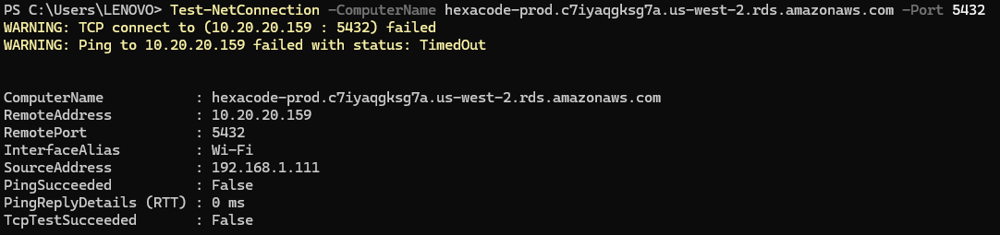

**Notes:**  
`Thử kết nối trực tiếp từ máy local (192.168.1.111) vào RDS port 5432 — TCP connect failed, TcpTestSucceeded: False. RDS nằm trong private subnet, Security Group chỉ cho phép inbound từ app-tier SG, không expose ra internet.`

---

## 8. Bonus — Real-World Ops Scenario *(Tùy chọn)*

> Chỉ điền nếu nhóm thực hiện ít nhất 1 scenario từ Bonus section.

---

### 8.1 Scenario Name

**Scenario attempted:** `[e.g. Simulated AZ failure / Blue-green deployment / Point-in-time restore]`  
**Date & time:** `[YYYY-MM-DD HH:MM UTC]`

---

### 8.2 Pre-condition (Before)

**Screenshot / metric:**

> *(Embed ảnh hoặc paste metric/log trước khi thực hiện scenario)*

```
[Pre-state evidence]
```

---

### 8.3 Execution

**Steps performed:**

1. `[Step 1]`
2. `[Step 2]`
3. `[Step 3]`

**Timing:**

| Event | Timestamp | Elapsed |
|---|---|---|
| Scenario triggered | `HH:MM:SS` | 0s |
| Failure detected | `HH:MM:SS` | `Xs` |
| Failover complete | `HH:MM:SS` | `Xs` |
| Service restored | `HH:MM:SS` | `Xs` |

---

### 8.4 Post-condition (After)

**Screenshot / metric:**

> *(Embed ảnh hoặc paste metric/log sau khi scenario hoàn tất)*

```
[Post-state evidence]
```

---

### 8.5 Reflection

**What worked well:**  
`[e.g. "Multi-AZ failover hoàn tất trong 87s, trong ngưỡng RTO mong đợi < 2 phút."]`

**What surprised us / could be improved:**  
`[e.g. "ElastiCache không failover tự động trong thời gian RDS failover — cache cold start gây tăng latency thêm ~15s. Cần pre-warm cache sau failover."]`

---

*— End of Evidence Pack —*
